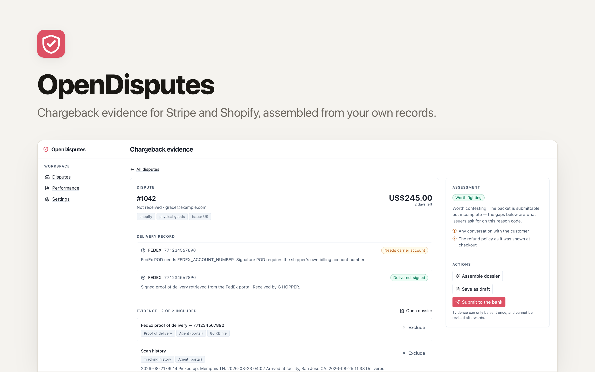

<p align="center">
  <picture>
    <source media="(prefers-color-scheme: dark)" srcset="./readme-banner-dark.png">
    
  </picture>
</p>

# OpenDisputes

[](https://app.clawnify.com/deploy?repo=clawnify/OpenDisputes)

Chargeback evidence for Stripe and Shopify, assembled from your own records.

An open-source app template provided by [Clawnify.com](https://clawnify.com).

Most chargeback tools take a percentage of what they recover for you.
Chargeflow charges 25% of each recovered chargeback; Disputifier 20%, capped at
$250. That is the going rate for evidence assembled out of records you already
hold. This is that software, except you run it and keep the recovery.

## What it does

**Assembles the dossier.** A dispute arrives by webhook. The app pulls the
order, the payment, the customer's activity, and the carrier's delivery record
into one evidence file, then renders it as a PDF an issuer can actually read.

**Proves the customer used what they paid for.** For a digital product there
is nothing to retrieve from a carrier, and the winning argument is a usage
history: this account paid on the 3rd, then rendered eleven images between the
4th and the 19th. That record only exists if it was being kept, so your app
posts events to `/api/activity` as they happen and the packet assembles itself
when a dispute lands. Where the processor does not hand over the payment date,
the summary says which date it measured from instead of quietly substituting one.

**Gets proof of delivery, including where an API cannot.** FedEx and UPS serve
proof of delivery through their own APIs, and the app uses them. But FedEx only
returns a signature POD to a request carrying the shipper's own billing account
number, which a merchant fulfilling through a 3PL does not have; USPS delivery
scans are not reliably available by API at all. Those cases are handed to your
Clawnify agent, which signs into the carrier portal with a real browser and
retrieves the document. Every item is tagged with how it was obtained.

**Tells you which disputes not to fight.** A parcel delivered to an address that
does not match the order argues for the cardholder. So does a not-received claim
with no delivery record, and a subscription that kept billing after a
cancellation request. The app says so, plainly, instead of packaging a loss.

**Stages by default.** Evidence can be submitted once per dispute and cannot be
revised. So the app prepares the packet and stops. You review it and press the
button. Automatic submission is available per reason code, off until you turn it
on, and never fires on a dispute the app would concede.

**Verifies that submissions actually landed.** Shopify's evidence mutation can
report success while the evidence never reaches the bank. The app re-reads the
dispute afterwards and compares; when they disagree it says so and asks your
agent to finish the job in the admin, rather than showing you a green tick.

**Shows you whether any of it works.** Win rate by reason code, by issuer
country, and (the one nobody sells back to you) whether retrieved proof of
delivery actually changes outcomes on your own traffic. Small samples are shown
as `1/3`, not as `33%`.

## Deploy

Or run it yourself:

```bash
pnpm install
cp .dev.vars.example .dev.vars   # add your processor keys
pnpm dev                          # UI on :5173, API on :8789
pnpm seed                         # optional demo data
```

## Connecting a processor

**Stripe.** Create a restricted API key with read on charges, invoices and
customers, and write on disputes and files. Add a webhook endpoint pointing at
`/api/webhooks/stripe` subscribed to `charge.dispute.created`,
`charge.dispute.updated` and `charge.dispute.closed`, and put its signing secret
in `STRIPE_WEBHOOK_SECRET`. Unsigned requests are refused.

**Shopify.** Create a custom app with `read_orders`, `read_fulfillments`,
`read_shopify_payments_disputes` and `write_shopify_payments_dispute_evidences`.

Either works alone. With both, one queue covers both stores.

Already have dispute history? Run **Sync processors** once; a webhook only
catches what happens next.

## Recording customer activity

Carrier proof of delivery answers a physical dispute. For a digital or
subscription product the equivalent evidence is what the customer did in your
product, and nothing can reconstruct it after the fact. Post events as they
happen:

```bash
curl -X POST https://your-app.apps.clawnify.com/api/activity \
  -H 'Content-Type: application/json' \
  -d '{"events":[
        {"customer_email":"jo@example.com","event_type":"signup",
         "occurred_at":"2026-02-14T09:12:00Z","external_id":"evt_1"},
        {"customer_email":"jo@example.com","event_type":"render",
         "occurred_at":"2026-03-05T10:00:00Z","external_id":"evt_2",
         "artifact_url":"https://cdn.example.com/room-1.png",
         "artifact_label":"Living room render"}
      ]}'
```

`event_type` is your own vocabulary; `signup` is the one value the summary looks
for by name. Send `external_id` and re-posting the same event is a no-op, so
retries and overlapping back-fill windows are safe. A row with an unparseable
`occurred_at` is rejected by index and the rest of the batch still lands, because
every claim the summary makes is a date comparison and a row that cannot be
compared would change the verdict without saying so.

`artifact_url` is worth more than a log line. "Here is the work they took
delivery of" outranks "our logs say they were active", and artifacts are listed
as their own evidence rather than folded into the summary.

Up to 1000 events per request.

## Carrier credentials

Optional. Without them the agent retrieves delivery records from the portal
instead, which works and is slower.

| Carrier | API proof of delivery | Needs |
|---|---|---|
| FedEx | Yes | `FEDEX_CLIENT_ID`, `FEDEX_CLIENT_SECRET`, `FEDEX_ACCOUNT_NUMBER` |
| UPS | Yes, as a POD letter | `UPS_CLIENT_ID`, `UPS_CLIENT_SECRET` |
| USPS | No, portal only | — |
| DHL | Varies by division | — |

UPS terms allow the electronic signature image only as part of a POD letter, so
the app retrieves and stores the letter and never the bare signature.

## What it deliberately does not do

- **No chargeback alerts.** Deflection networks are a paid subscription to a
  card-network feed, not something software can synthesise.
- **No guarantee.** Products that reimburse you still leave the chargeback
  counting against your ratio. Know which one you are buying.
- **No auto-refunding.** Refunding every alert to keep a dispute rate down is
  a decision about your revenue, not a default worth shipping.

## Licence

MIT.
